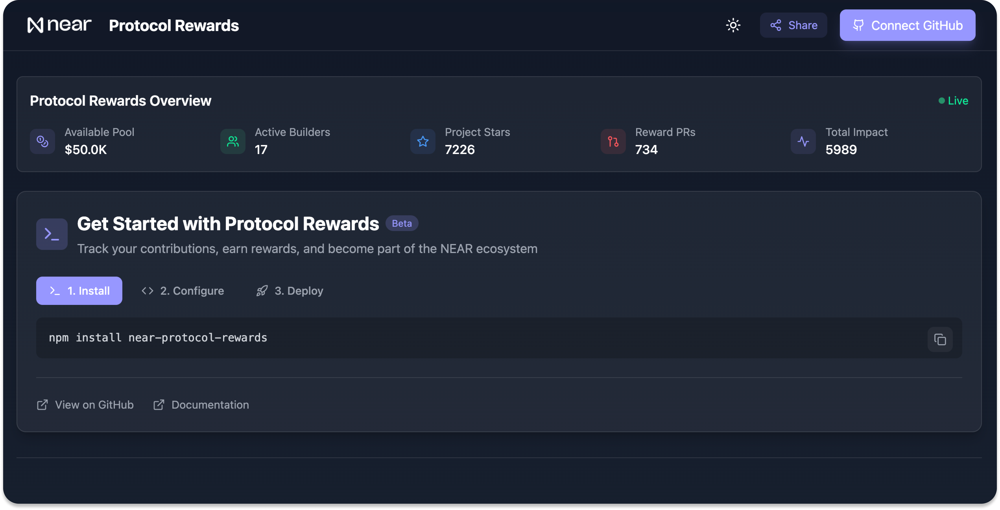

# NEAR Protocol Rewards Dashboard

A dashboard for tracking the NEAR Protocol rewards program and managing developer contributions in the NEAR ecosystem.

<div align="center">
  
</div>

## 🌟 Features

- **Real-time Metrics Tracking**
  - GitHub activity monitoring
  - Smart contract usage analytics
  - Community impact measurement
  - Contribution quality scoring

- **Reward System**
  - Tiered progression system
  - Dynamic reward multipliers
  - Achievement tracking
  - Performance-based incentives

- **Developer Tools**
  - SDK integration
  - API documentation
  - Deployment tracking
  - Analytics dashboard

## 🚀 Quick Start

### Prerequisites

- Node.js 16.x or later
- npm 7.x or later
- GitHub account
- NEAR account

### Installation

1. Clone the repository:

```bash
git clone https://github.com/near/rewards-dashboard.git
```

2. Install dependencies:

```bash
npm install
```

3. Create a `.env.local` file and add your API keys:

```bash
touch .env.local
```

see `.env.example` for reference.

4. Start the development server:

```bash
npm run dev
```

## 🛠 Tech Stack

- **Frontend**: React 18, TypeScript, Vite
- **Styling**: Tailwind CSS
- **Components**:
  - Radix UI (Collapsible, Tooltip)
  - Lucide React Icons
- **Authentication**: GitHub OAuth
- **State Management**: React Hooks
- **API Integration**: NEAR Protocol, GitHub API

## 🤝 Contributing

We welcome contributions to improve the dashboard's functionality and user experience. Please see our [CONTRIBUTING.md](CONTRIBUTING.md) for guidelines on how to submit improvements and bug fixes.    

License

This project is licensed under the MIT License. See the [LICENSE](LICENSE) file for details.

Made with ❤️ by [@near](https://github.com/near)
