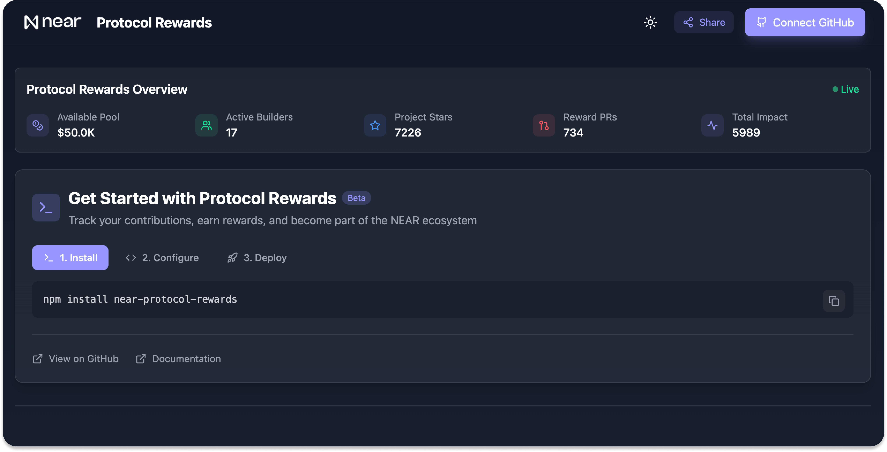

# NEAR Protocol Rewards Dashboard

A dashboard for tracking the NEAR Protocol rewards program and managing developer contributions in the NEAR ecosystem.

<div align="center">
  
</div>

## 🌟 Features

- **Real-time Contribution Tracking**
  - GitHub activity monitoring
  - Pull request and commit tracking
  - Code review participation
  - Issue management metrics

- **Developer Metrics**
  - Individual contribution analytics
  - Team collaboration insights
  - Historical performance tracking
  - Activity trend visualization

- **Reward System Integration**
  - Automated reward calculations
  - Performance-based incentives
  - Real-time reward updates
  - Multiple contribution factors

## 🚀 Quick Start

### Prerequisites

- Node.js 16.x or later
- npm 7.x or later
- GitHub account with OAuth setup
- Vite-based development environment

### Development Setup

1. Clone the repository:

```bash
git clone https://github.com/jbarnes850/protocol-rewards-dashboard.git
cd protocol-rewards-dashboard
```

2. Install dependencies:

```bash
npm install
```

3. Configure environment variables:

```bash
# Copy example environment files
cp .env.example .env.development
```

Required environment variables:

```env
# Development Environment (Mock SDK)
VITE_USE_MOCK_SDK=true
VITE_MOCK_UPDATE_INTERVAL=30000

# GitHub OAuth Configuration
VITE_GITHUB_CLIENT_ID=your_github_client_id
VITE_GITHUB_CLIENT_SECRET=your_github_client_secret
VITE_GITHUB_TOKEN=your_github_token

# API Configuration
VITE_GITHUB_API_URL=https://api.github.com
VITE_GITHUB_ORG=near
```

4. Start the development server:

```bash
npm run dev
```

## 🛠 Tech Stack

- **Frontend Framework**
  - React 18 with TypeScript
  - Vite for build tooling
  - TailwindCSS for styling

- **Component Libraries**
  - Radix UI primitives
  - Lucide React icons
  - Custom UI components

- **Development Tools**
  - Mock SDK for development
  - TypeScript for type safety
  - ESLint and Prettier for code quality

- **State Management**
  - React Context for global state
  - Custom hooks for business logic
  - TypeScript interfaces for type definitions

## 📦 Mock SDK Implementation

The dashboard currently uses a mock SDK implementation for development and demonstration purposes. The mock SDK provides:

- Realistic data generation
- Real-time updates simulation
- Configurable update intervals
- Type-safe interfaces
- Event-based architecture

To switch between mock and real SDK:

```env
# Development (Mock SDK)
VITE_USE_MOCK_SDK=true

# Production (Real SDK)
VITE_USE_MOCK_SDK=false
```

## 🤝 Contributing

We welcome contributions! Please see our [CONTRIBUTING.md](CONTRIBUTING.md) for guidelines.

## 📄 License

This project is licensed under the MIT License. See the [LICENSE](LICENSE) file for details.

---
Made with ❤️ by [@near](https://github.com/near)
